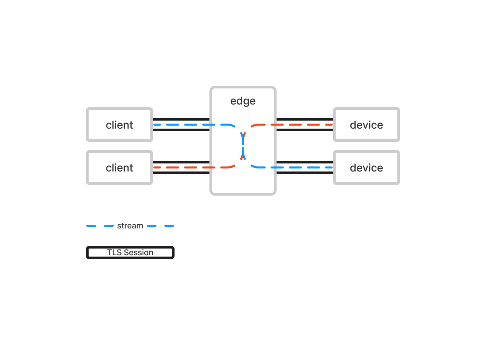

# go.qbee.io/transport

## Introduction

This repository contains the implementation of the qbee remote access transport protocol.
It is used to establish a secure connection between a device and the qbee infrastructure.

## Protocol

The protocol upgrades a standard HTTPS request to a [smux](https://github.com/xtaci/smux) session. This ensures that the connection is less likely to be blocked by firewalls and proxies, and allows for multiplexing of multiple streams over a single TCP connection. The brokering of smux streams is performed by the qbee edge service and is not part of the transport protocol itself (even though a mock edge service implementation is provided for testing purposes).

Each smux stream initiated by the client is verified and authorized by the edge service before passing to the device. The device cannot initiate smux streams. 

Each stream begins with a [message](message.go) which determines the type of the stream and contains the necessary metadata. After the initial message, the stream becomes a plain duplex connection and the data exchange format is specific to the initial message type.

## Authentication

Device authentication is based on mTLS and uses the same device key/certificate pair issued by the qbee platform during device bootstrap.

Client authentication is based on authorization header.

## Authorization

Device and Client authorization is performed by the qbee edge service and is not part of the transport protocol.

## Privacy and Integrity

Privacy and integrity of the transport protocol is ensured by TCP and TLS 1.3. Any communication between a client and a device uses a separate data stream and is encrypted using a separate TLS session.